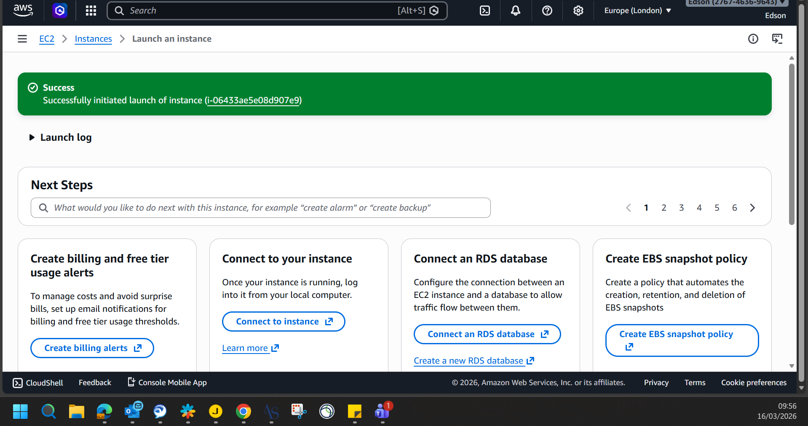
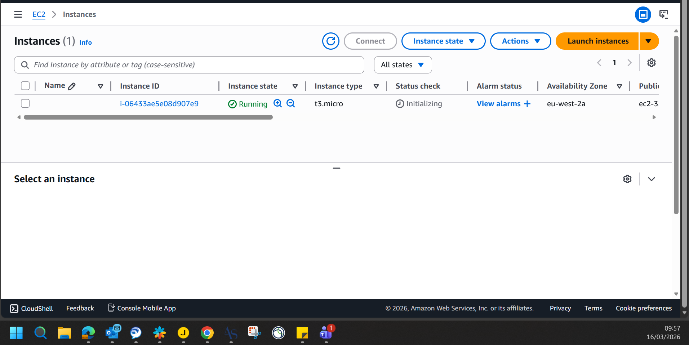
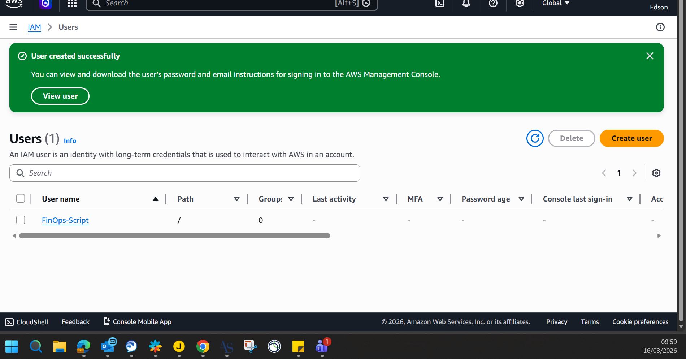
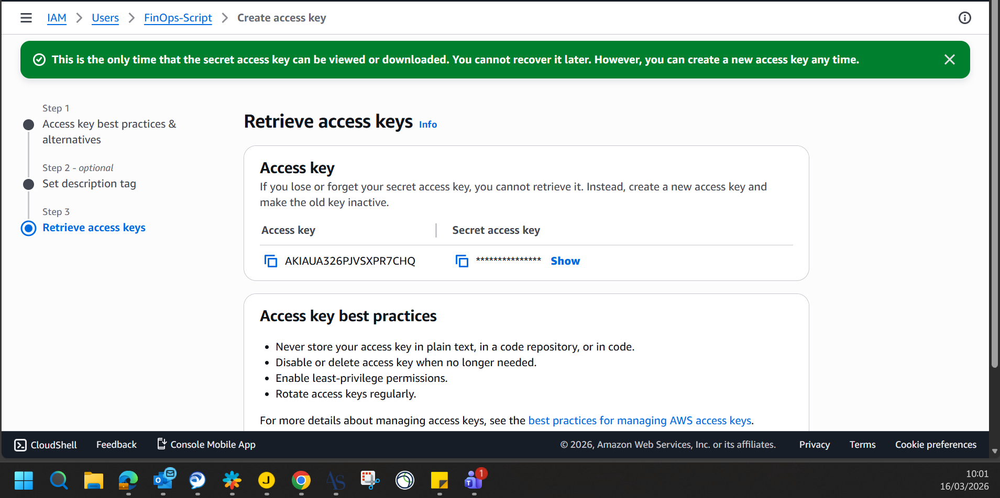
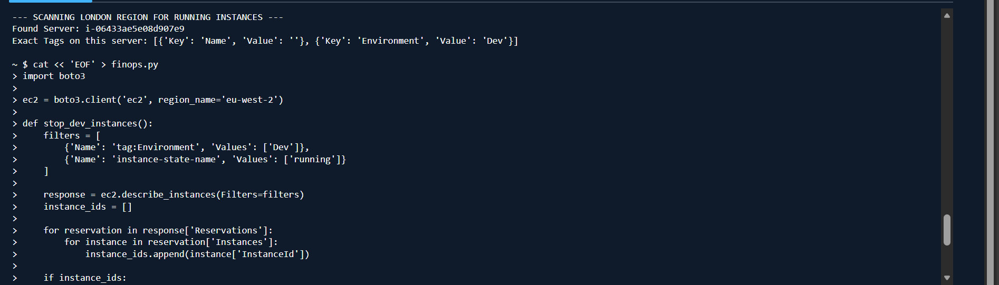
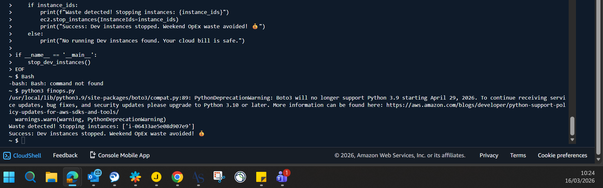
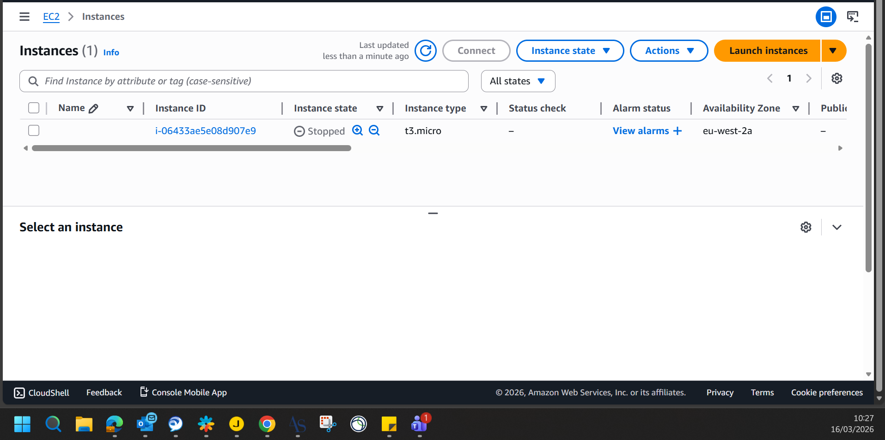
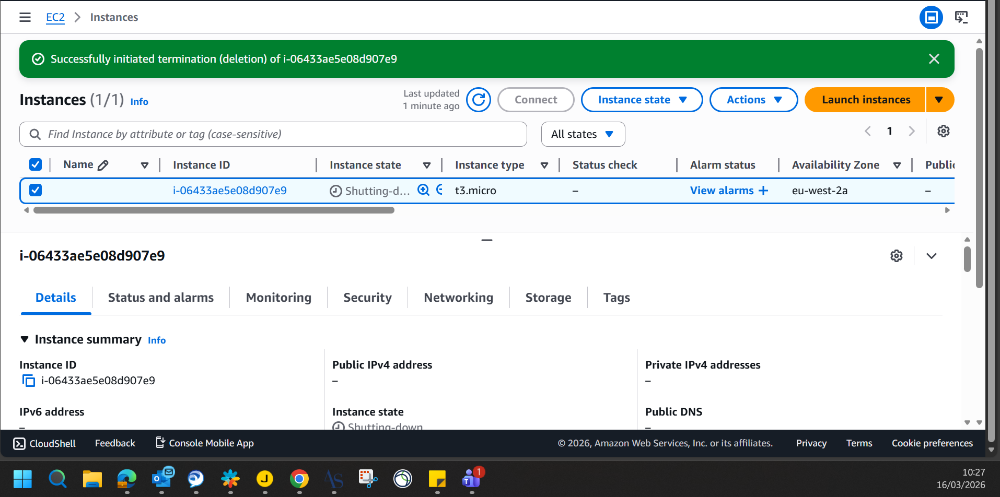

# ☁️ AWS FinOps: Automated EC2 Cost Optimization

## 📊 The Business Problem
In cloud environments, a common source of **OpEx waste** occurs when development and testing servers (Amazon EC2) are left running outside of business hours. Paying for idle compute capacity over the weekend directly violates cloud right-sizing and cost-efficiency principles.

## 🛠️ The Solution
I engineered an automated Python script utilizing the **AWS Boto3 SDK** to enforce cost-control governance. 

The script programmatically scans the AWS environment (eu-west-2) to identify any running instances carrying the specific resource tag `Environment: Dev`. It then safely issues a stop command to those specific instances, ensuring the business only pays for compute power when it is actively being utilized.

## 🚀 Technologies Used
* **Python 3** (Core logic and automation)
* **AWS Boto3** (Programmatic API interaction with AWS)
* **Amazon EC2** (Compute resource management)
* **AWS IAM** (Secure, least-privilege access execution)

## 💡 Commercial Impact
* Eliminates weekend CapEx/OpEx drain caused by human error (forgetting to turn off servers).
* Demonstrates practical application of cloud elasticity (paying only for what you use).
* Replaces manual IT Service Desk intervention with a scalable, £0.00 cost automated script.

### 📸 Proof of Execution

**1. Targeted Instance Creation & Resource Tagging:**
Provisioning the EC2 instance within the Free Tier and applying the specific `Environment: Dev` tag for script targeting.

**2. Verified Running State:**
Confirming the instance is active and consuming resources prior to automation execution.

**3. IAM Governance Setup:**
Creating a dedicated IAM user with specific programmatic access to ensure secure script execution.

**4. Secure Access Key Generation:**
Provisioning the necessary credentials for the Boto3 SDK to communicate with the AWS API.

**5. Automation Script Execution:**
Triggering the Python logic via AWS CloudShell to scan the region for idle resources.

**6. FinOps Waste Detection & Success:**
The script successfully identifies the tagged instance and issues the stop command to eliminate OpEx waste.

**7. Verified Stopped State:**
Confirmation that the instance has successfully moved to a stopped state, halting compute billing.

**8. Final Resource Termination:**
Executing a full teardown of the resource to maintain a zero-cost infrastructure footprint.

