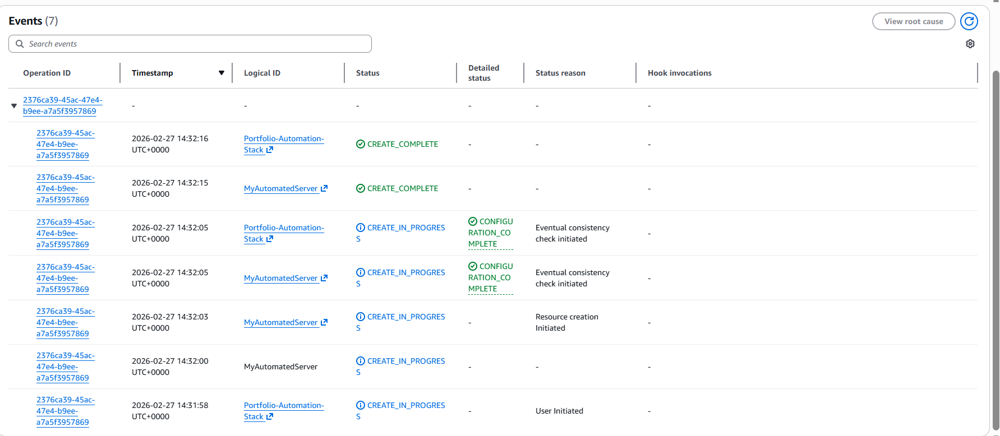
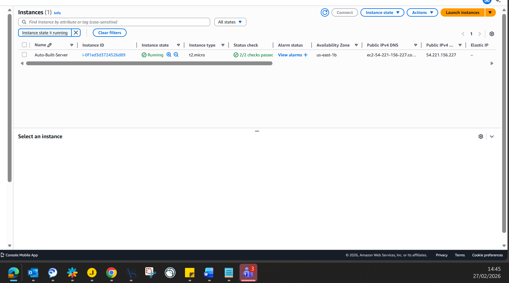
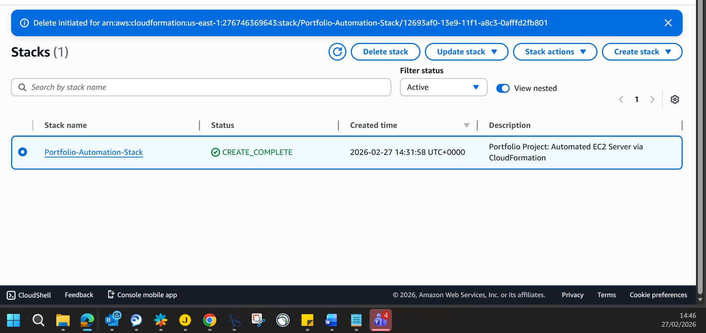
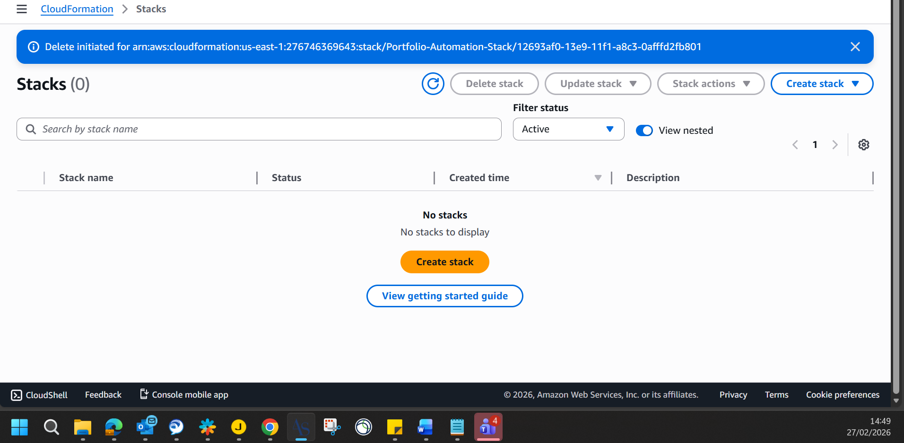

# ⚙️ Project: Infrastructure as Code (IaC) Deployment

**Objective:** Automate the provisioning and teardown of AWS infrastructure using declarative code to ensure repeatable, consistent, and error-free deployments.

## 🗺️ Architecture Diagram
iac-cloudformation-architecture-v5.png

### 🛠️ Architecture & Execution
* Wrote a custom **YAML** template defining an Amazon EC2 instance and its configuration parameters.
* Deployed the template via **AWS CloudFormation** to orchestrate the automated creation of the resources without manual console interaction.
* Verified the successful deployment and automatic tagging of the target server.
* Executed a one-click stack deletion to automatically terminate the instance and clean the environment, demonstrating strict FinOps control.

### 📜 The Code
The declarative code used to build this architecture is included in this directory: **[infrastructure.yaml](infrastructure.yaml)**

### 📸 Proof of Execution

**1. CloudFormation Stack Creation (Reading the Code):**

**2. The Automated Server Successfully Provisioned:**

**3. Initiating the Automated Teardown (DELETE_IN_PROGRESS):**

**4. Infrastructure Cleanly Destroyed (Account Cleaned):**

