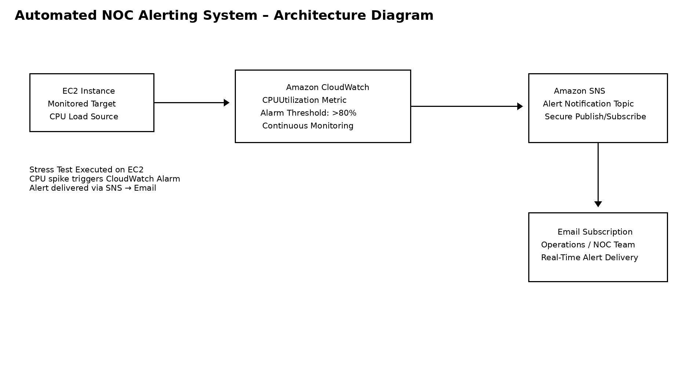
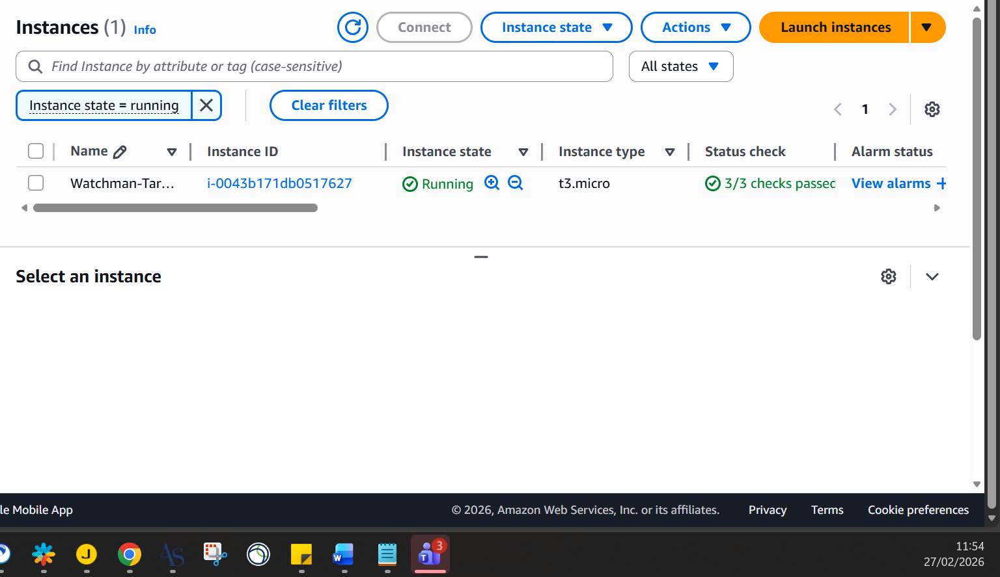
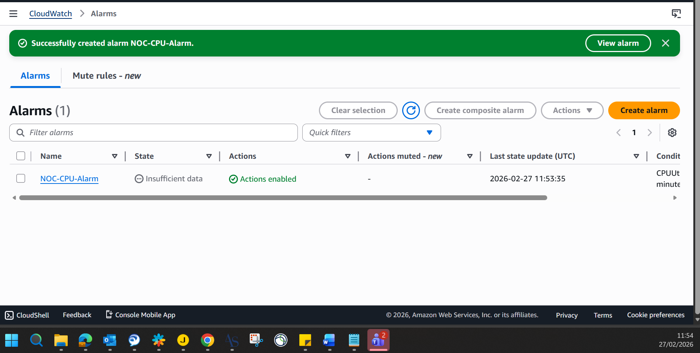
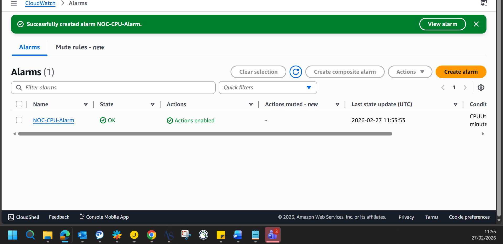
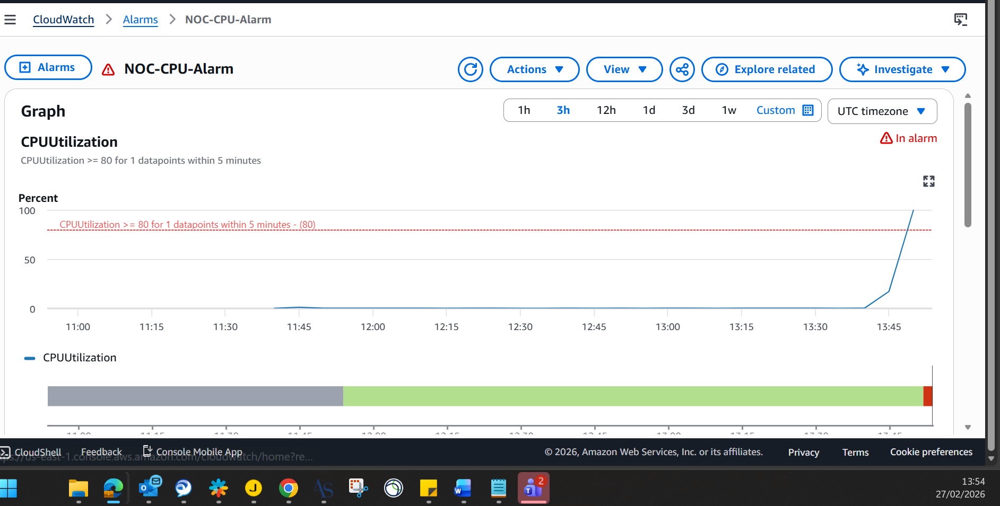
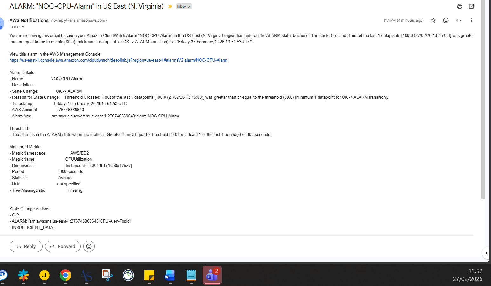

# 🚨 Project: Automated NOC Alerting System

**Objective:** Architect a real-time monitoring and alerting system to automatically detect and report compute performance anomalies.

## 🗺️ Architecture Diagram

### 🛠️ Architecture & Execution
* Provisioned an **Amazon EC2** instance to serve as the baseline monitored target.
* Configured an **Amazon SNS** (Simple Notification Service) topic and authorized an email subscription for secure alert routing.
* Deployed an **Amazon CloudWatch** alarm to continuously monitor `CPUUtilization`, setting a strict 80% threshold.
* Executed a simulated CPU stress test via the Linux terminal (creating continuous background processes) to intentionally breach the threshold and validate the automated alerting pipeline.

### 📸 Proof of Execution

**1. The Monitored Target (EC2 Instance):**

**2. Alarm Initialization (Gathering Baseline Metrics):**

**3. Normal Operations (System OK):**

**4. The Stress Test (CPU Threshold Breached):**

**5. Automated Alert Delivery:**

