# 🌐 Project: Custom VPC Architecture & Secure Networking

**Objective:** Architect a secure, highly available Virtual Private Cloud (VPC) from scratch, demonstrating strict network isolation and routing controls, followed by a complete infrastructure teardown.

## 🗺️ Architecture Diagram
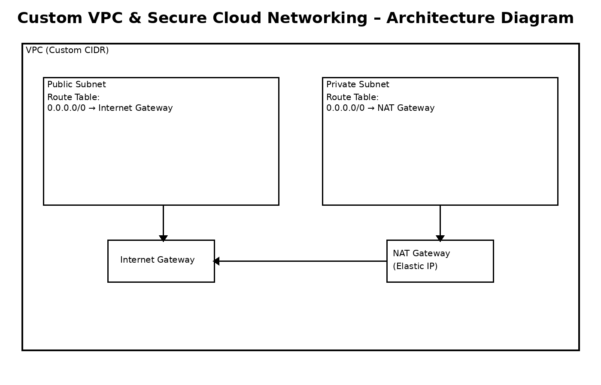

### 🛠️ Architecture & Execution
* Provisioned a custom **Amazon VPC** with a dedicated CIDR block.
* Carved out strict network boundaries by creating a **Public Subnet** (auto-assigned public IPs enabled) and a **Private Subnet** (fully isolated).
* Deployed an **Internet Gateway (IGW)** to provide public internet access to the public tier.
* Deployed a **NAT Gateway** with an Elastic IP to allow resources in the private subnet to securely download updates without inbound internet exposure.
* Configured custom **Route Tables** to securely direct traffic between the subnets and gateways.
* Executed a complete, automated resource teardown to maintain a $0.00 FinOps footprint.

---

### 📸 Proof of Execution

#### Phase 1: The Foundation (VPC & Subnets)
**1. Custom VPC Created:**
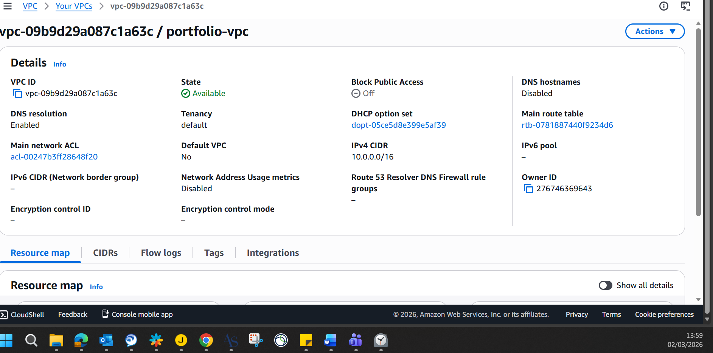

**2. Subnets Initialized:**
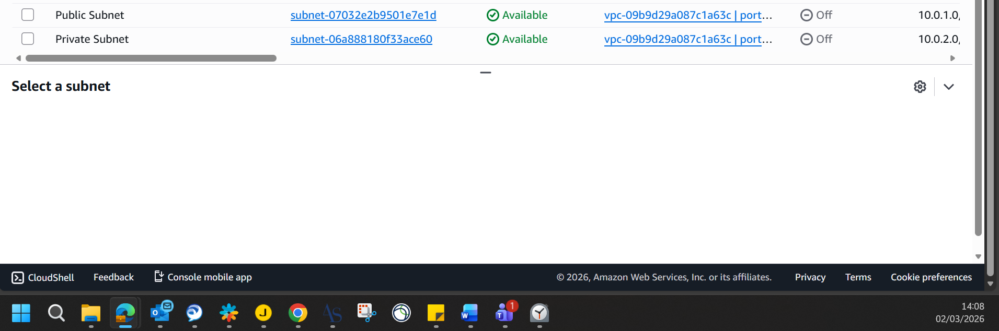
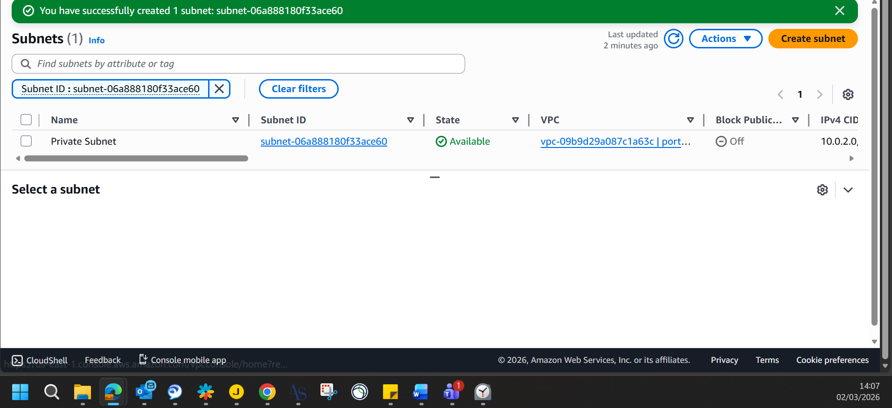

**3. Configuring Network Isolation (Auto-Assign IPs):**
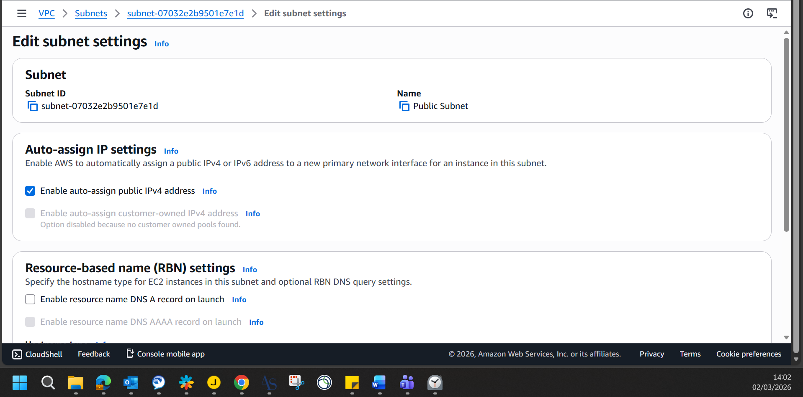
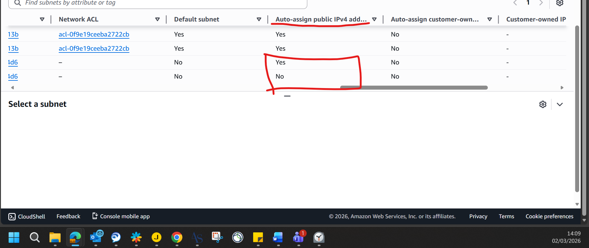

#### Phase 2: The Gateways (Public & Private Access)
**4. Internet Gateway Attached (Public Access):**
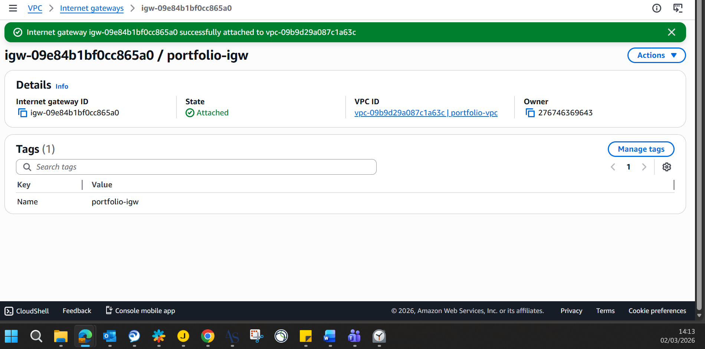

**5. NAT Gateway Provisioned (Secure Private Access):**
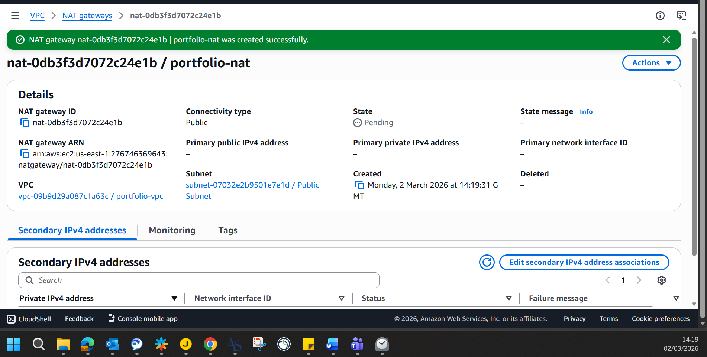

#### Phase 3: The Routing (Connecting the Pipes)
**6. Public Route Table & Subnet Association:**
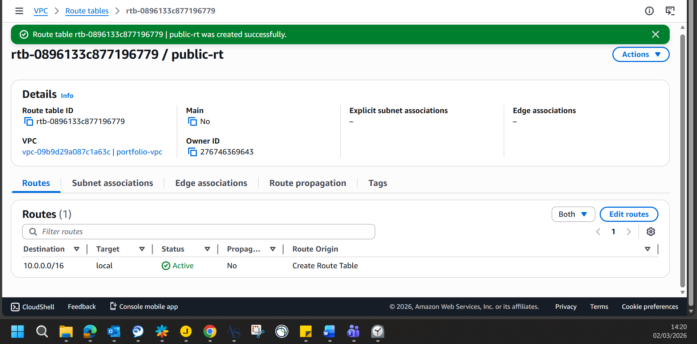
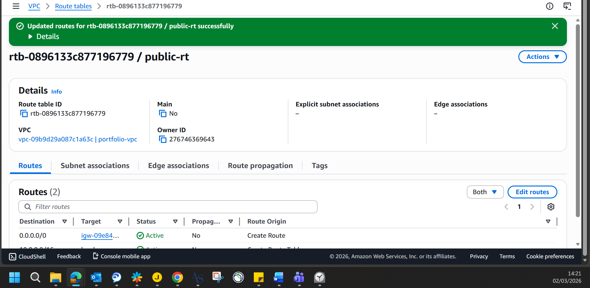
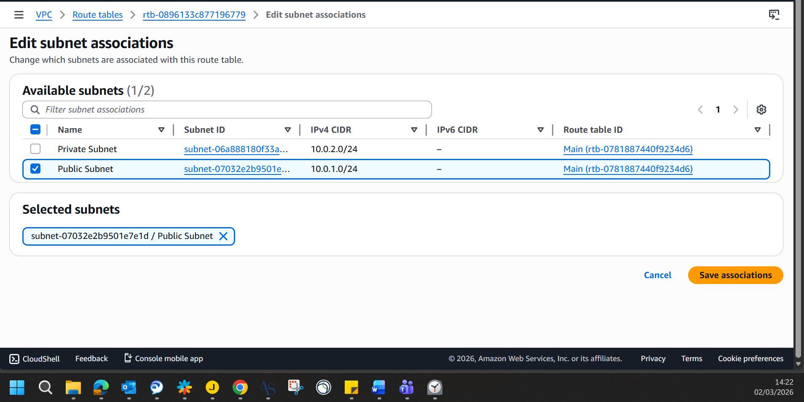

**7. Private Route Table & Subnet Association:**
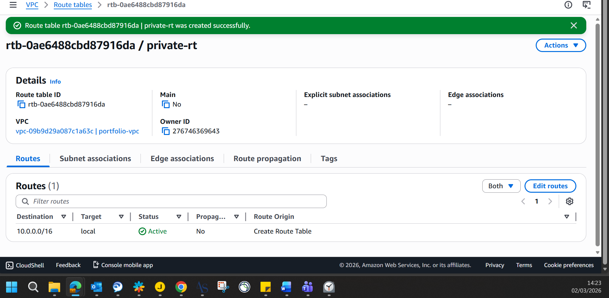
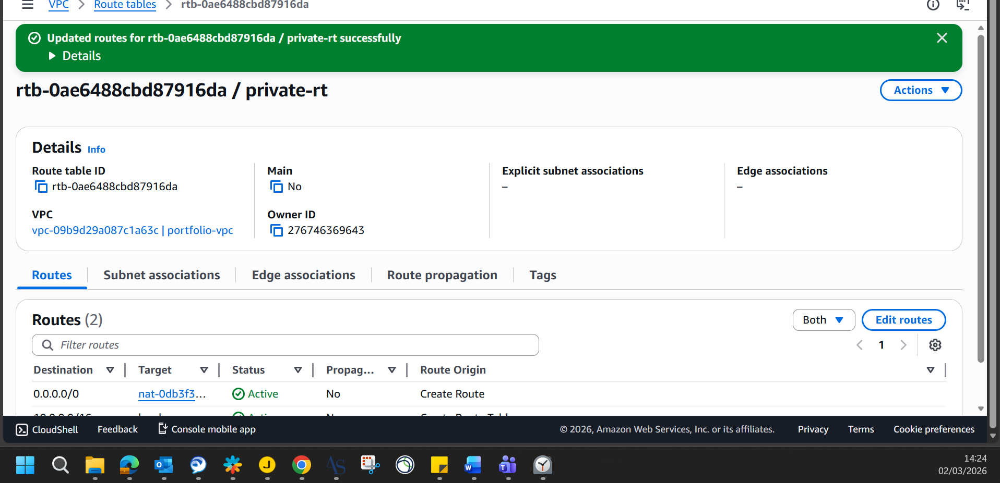
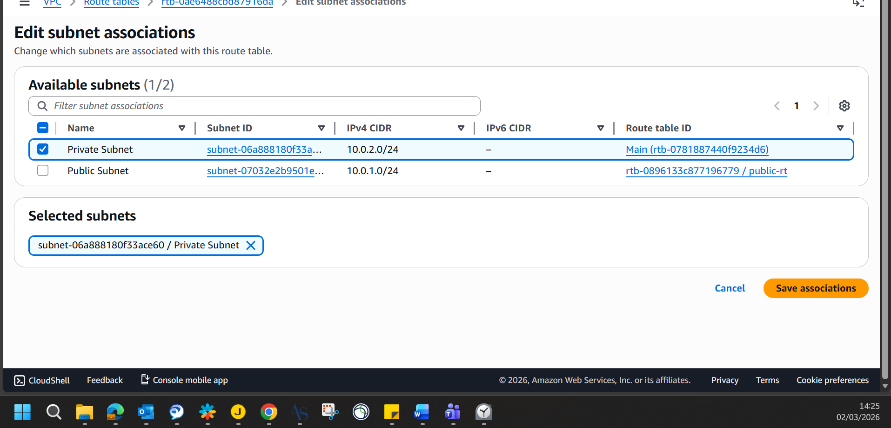

**8. Successful Routing Verification:**
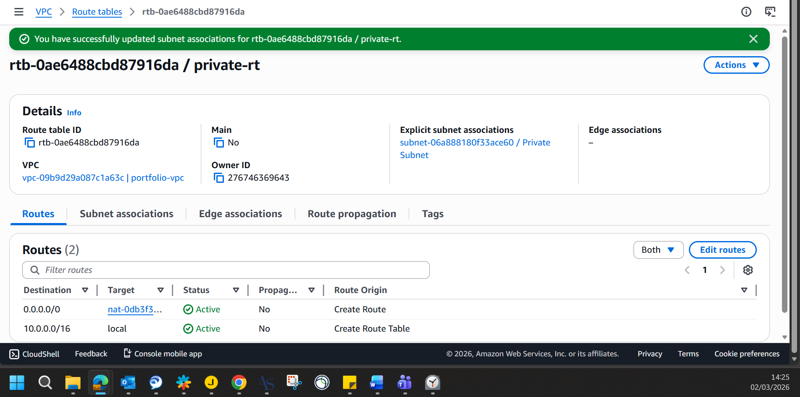

#### Phase 4: FinOps & Infrastructure Teardown
**9. Destroying the NAT Gateway:**
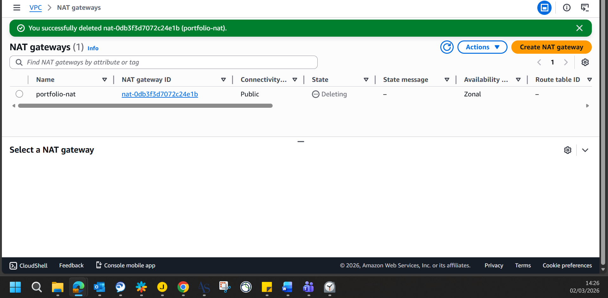
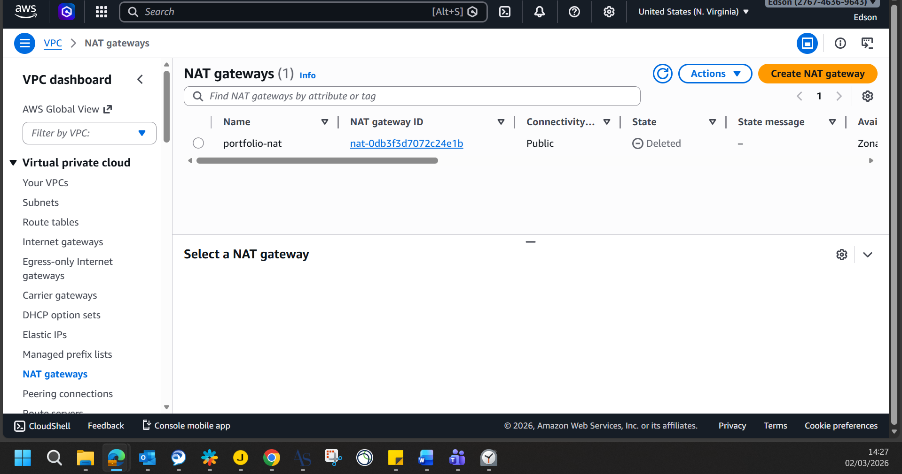

**10. Releasing the Elastic IP (Cost Prevention):**
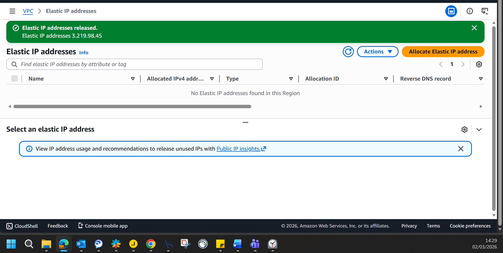

**11. Final Clean Slate (VPC Destroyed):**
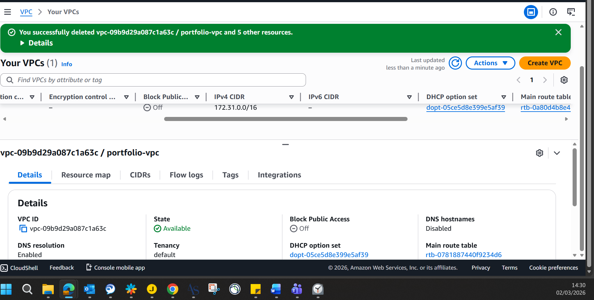
